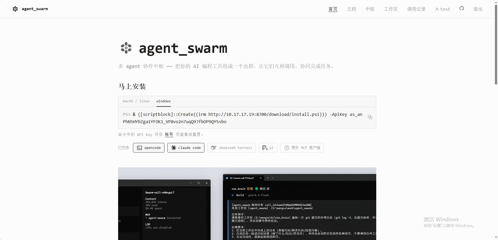
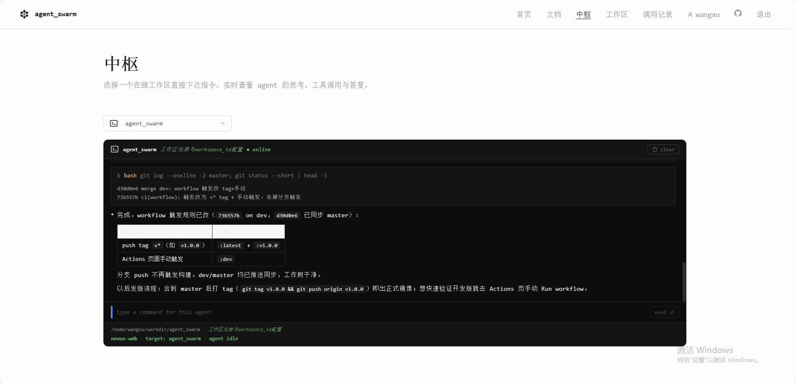

# agent_swarm

<p align="center">
  <b>多 agent 协作中枢（虫群）</b><br/>
  把你的 AI 编程工具组成一个虫群，让它们互相调用、协同完成任务
</p>

<p align="center">
  <a href="./README.md">English</a>
</p>

<div align="center">



</div>

## 功能摘要

- **🔗 标准 MCP 工具接入** —— 面向 agent 的操作全部是标准 MCP 工具，opencode、claude code 等任何支持 MCP 的客户端都能接入
- **🐝 跨 agent 任务派发** —— 一条指令把任务交给另一个工作区的 agent；前台注入（对方 TUI 实时可见）或后台会话（静默执行）两种方式，结果自动回传
- **🌐 Web 中枢（Nexus）** —— 网页上直接给在线工作区下指令，实时围观思考 / 工具调用 / 回答，权限请求远程点选应答
- **👀 监控模式** —— 你在 TUI 里的日常对话按轮次实时同步到网页，像给 agent 开了一扇观察窗
- **💬 飞书接入** —— 绑定飞书后在聊天里派任务、收时间线直播与完成简报、远程应答权限请求
- **🛡️ 自托管 & 轻量** —— 单个 FastAPI 服务 + SQLite，一条命令启动，数据完全留在自己机器上
- **🎛️ 后台管理** —— 独立登录的管理控制台：用户 / 工作区 / 调用量面板

## 部署

### 方式一：Docker（推荐）

镜像由 GitHub Actions 自动构建并推送 GHCR（`ghcr.io/risingwater/agent_swarm`）。

```bash
# 拉取并启动（compose.yaml 含完整参数）
docker compose -f docker/compose.yaml up -d

# 私有仓库先登录 GHCR（token 勾选 read:packages）
echo <GITHUB_TOKEN> | docker login ghcr.io -u <用户名> --password-stdin
```

不想用 compose 也可以手动运行：

```bash
docker run -d --name agent-swarm -p 8700:8700 \
  -v agent-swarm-data:/app/data \
  -v /path/to/.env:/app/.env \
  ghcr.io/risingwater/agent_swarm:latest
```

本地构建镜像：

```bash
docker build -t agent-swarm -f docker/Dockerfile .
```

> 版本策略：push `v*` / `release*` tag → `:latest` + 版本号 tag；`alpha*` / `beta*` tag → 预发布 tag；Actions 页手动触发 → `:dev`。

### 方式二：源码启动

```bash
# Linux / macOS（自动建 venv、装依赖、打包插件，前台运行）
./deploy/start.sh                # 默认 :8700

# Windows
.\deploy\start.ps1
```

启动后打开 `http://localhost:8700`：注册账号 → 「API Key」页复制密钥。

### 接入 agent 工作区

在装有 AI 编程工具的目标机器上执行首页生成的安装命令：

```bash
# Linux / macOS
curl -fsSL http://<server>:8700/download/install.sh | bash -s -- --api-key <你的key>

# Windows (PowerShell)
& ([scriptblock]::Create((irm http://<server>:8700/download/install.ps1))) -ApiKey <你的key>
```

- **opencode**：写入服务配置 → 注册 MCP 端点 → 部署心跳插件 → 拷贝 `/swarm-*` 命令。**重启 opencode 后生效**
- **claude code**：注册 remote MCP + 本地 keepalive（心跳保活）→ 拷贝 `/swarm-*` 命令。**重启后生效**；claude 仅支持后台会话，不支持前台注入

### 接入飞书（可选）

1. [飞书开放平台](https://open.feishu.cn) 创建自建应用，开启机器人能力
2. 配置事件订阅（长连接模式）并添加 `im:message` 收发与 `contact:user.basic_profile:readonly` 权限，发布版本
3. 服务端 `.env` 配置：

```ini
FEISHU_APP_ID=cli_xxx
FEISHU_APP_SECRET=xxx
```

重启服务后，在飞书里给机器人发 `/swarm bind as_你的密钥` 完成绑定。

## 详细功能

### Web 中枢（Nexus）

<div align="center">



</div>

登录后进入「中枢」页，选择在线工作区直接输入指令：

- 时间线实时滚动 agent 的**思考、工具调用与回答**
- 权限请求和 AI 提问**直接在页面点选应答**，不用回到终端
- 历史持久化保存，向上滚动逐轮加载更早对话
- 后台任务按来源归组到独立会话，前台注入则进入对方当前会话实时可见

### 监控模式

开启后（opencode 默认开，TUI 内 `/swarm-monitor` 切换），你在 TUI 里与 agent 的日常对话按轮次实时同步到网页中枢：提问、思考、工具调用、回答全程可见，权限请求远程应答。每轮对话作为 `[monitor]` 记录进入「调用记录」页。

一个工作区同时只有一个前台轮次：新一轮开始时上一轮自动收尾，不会出现永远卡在执行中的条目。

### 飞书（nexus-feishu）

绑定后（`/swarm bind as_xxx`）：

| 能力 | 说明 |
|---|---|
| 派任务 | 直接发文本 = 给选中工作区下指令 |
| 时间线直播 | 开启监控的窗口：TUI 对话按轮次推成一组小卡（用户卡 → 💭 思考 → 每个工具一张卡 → 🤖 最终答复） |
| 完成简报 | 任务完成/失败后推结果摘要卡（默认开，`/swarm brief off` 关闭） |
| 权限/提问卡 | 任意工作区的任务等待应答时推操作卡，点按钮远程允许/拒绝 |
| 命令菜单 | 发未知命令返回菜单卡：状态摘要 + 按当前状态过滤的命令按钮 |

聊天命令：`/swarm bind` · `unbind` · `list` · `select` · `status` · `monitor on|off` · `brief on|off` · `last`。工作区/监控/简报也可在网页「账号 → 聊天工具绑定」里管理，修改后飞书会收到通知。

### 后台管理

访问 `/#/admin`（独立登录，凭据见配置表）：

- **面板**：用户数 / 在线工作区数 / 指令总数 + 近 30 天每日指令折线图
- **用户**：列表（含绑定飞书 ID）、重置密码（一次性展示新密码，不动 API Key）
- **工作区**：全量列表（归属用户 / 用途 / 当前会话 / 在线状态 / 24h 调用量）

### 调用记录

所有跨 agent 调用、网页中枢指令、监控轮次、飞书派发都归档为记录：发起方 / 目标 / 指令 / 状态 / 结果，可按工作区筛选、可删除。

## MCP 工具一览（`/mcp/`，Bearer apikey 鉴权）

| 工具 | 说明 |
|---|---|
| `workspace_add` | 注册当前目录为工作区，返回 ID（写入项目根 `.agent_swarm/workspace.md`） |
| `workspace_remove` / `workspace_enable` / `workspace_disable` / `workspace_offline` | 工作区管理（仅离线可删） |
| `heartbeat` | 心跳保活，上报当前会话（插件每 30s 自动调用） |
| `update_info` / `update_notes` | 更新工作区用途/能力描述、备注 |
| `list_workspaces` | 列出可见工作区（默认仅在线） |
| `a2a_call` | A2A 协议任务派发：内部工作区 ID 或外部 A2A agent 端点 URL（`from_workspace` 注明发起方） |
| `a2a_task` | 查询 A2A 任务状态与结果 |

## 配置

| 环境变量 | 说明 | 默认 |
|---|---|---|
| `AGENT_SWARM_PORT` | 服务端口 | `8700` |
| `AGENT_SWARM_DB` | SQLite 路径 | `<项目根>/data/agent_swarm.db` |
| `AGENT_SWARM_JWT_SECRET` | JWT 签名密钥（**生产必设**） | dev secret |
| `AGENT_SWARM_PUBLIC_URL` | 公网地址（注入 install 脚本，反代时设） | 从请求 Host 推断 |
| `AGENT_SWARM_CALL_TIMEOUT` | 跨 agent 调用超时 | `3600`s |
| `ADMIN_USERNAME` / `ADMIN_PASSWORD` | 后台管理登录（默认 `admin` / `Admin123!@#`，**生产必改**） | `admin` / `Admin123!@#` |
| `FEISHU_APP_ID` / `FEISHU_APP_SECRET` | 飞书自建应用凭据（两者都配置后飞书网关随服务启动） | 未配置不启动 |

环境变量优先于项目根 `.env`。

## 目录结构

```
server/            FastAPI 服务端（api/ REST、mcp_endpoint.py MCP 工具、feishu/ 飞书网关、download.py 插件分发）
plugins/opencode/  opencode 插件（TS）：心跳、任务接收执行、监控上报、中枢直连；commands/ 为 /swarm-* 命令源
plugins/claude/    claude code 接入：keepalive.mjs（本地 MCP 保活）+ 后台任务执行 + /swarm-* 命令
web/               React 管理前端（首页、文档、中枢、工作区、调用记录、账号、后台管理）
deploy/            启动/停止脚本 + 安装分发器（sh + ps1）
docker/            Dockerfile + compose.yaml
docs/              补充文档与截图
```

## 开发

```bash
./deploy/start.sh                        # 服务端（改 server/ 后重启生效；同时打包 plugins/ 到 data/）
cd web && npm run dev                    # 前端 dev :8701（代理 /api /mcp /download 到 8700）
cd web && npm run build                  # 前端构建（产物由 8700 静态托管）
cd web && npm run lint                   # oxlint
cd plugins/opencode && npm run typecheck # opencode 插件类型检查
```

> 改了 `plugins/opencode/src/` 后需要重装插件并**重启 opencode** 才生效（运行中的会话持有旧代码）。
> 含中文的 ps1 安装脚本必须保存为 UTF-8 **with BOM**（本地 PS 5.1 按 ANSI 读无 BOM 文件会乱码破坏语法）；分发器自身经 `irm | iex` 执行时由服务端以文本下发，无 BOM 要求。

## 许可证

[](./LICENSE)

本项目采用**双许可**：

- **开源**：[AGPL-3.0-only](./LICENSE) —— 免费，用于学习、内部工具、开源衍生（遵守全部 AGPL 义务，含网络条款：即使只提供网络服务也须开放源码）。
- **商业闭源**：需要将本代码集成进闭源产品、以 SaaS 形式提供服务而不开放源码等场景，请购买[商业许可](./LICENSE-COMMERCIAL_CN.md)（[英文版](./LICENSE-COMMERCIAL.md)）。

贡献前请阅读 [CLA.md](./CLA.md)——提交 PR 即视为同意其条款（授予版权所有者商业再许可权）。

## 安全说明

- MCP 与 REST 全部走鉴权（apikey / JWT）；`/download/*` 与 `/health` 除外
- SQLite 明文存 apikey 便于用户随时查看；JWT secret 生产环境务必设置
- 跨 agent 任务会注入目标工作区的会话，请只把你信任的机器接入虫群
